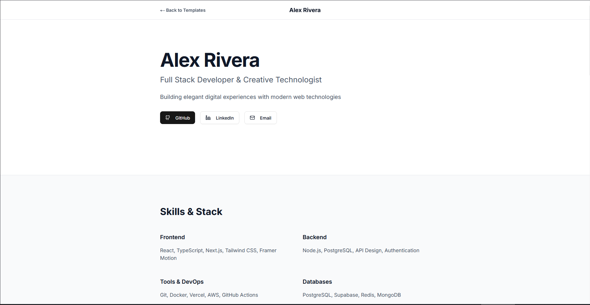
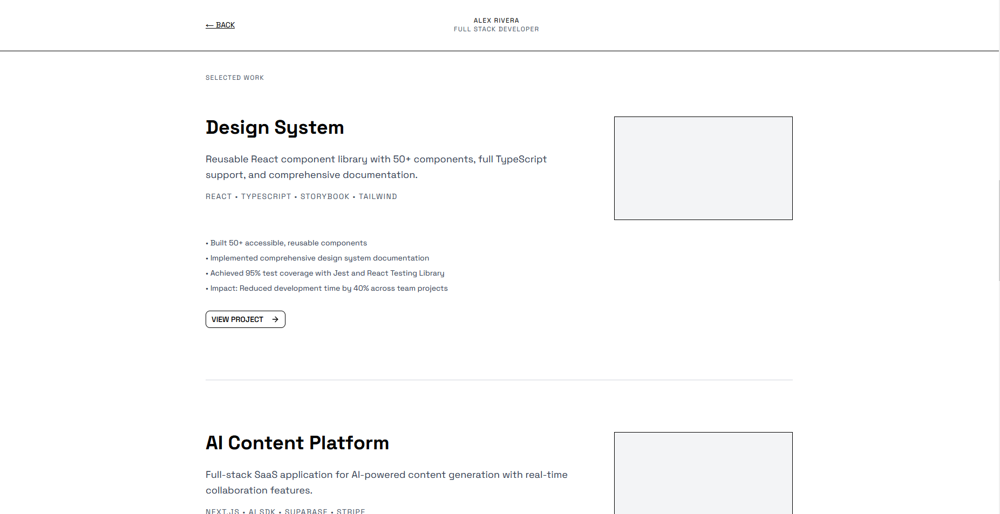
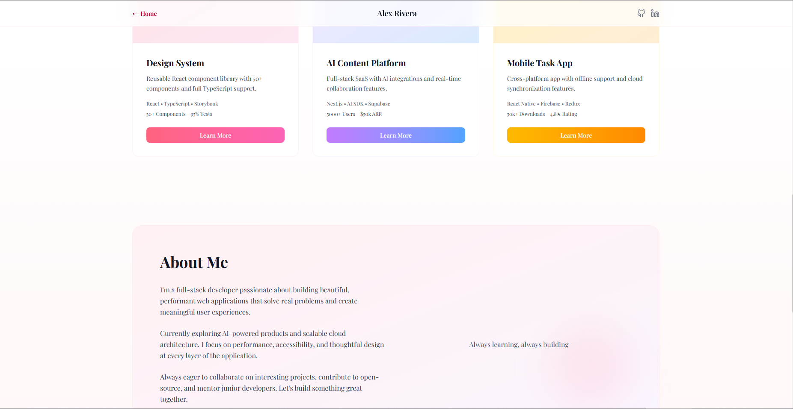

# Portfolio Templates

A collection of three beautifully designed portfolio templates built with Next.js, React, and Tailwind CSS. Each template presents the same portfolio content (hero, skills, projects, about, and contact) in a unique visual style, demonstrating how design choices can dramatically transform the presentation without changing the underlying content.

## Purpose

This repository provides three ready-to-use portfolio templates that you can customize for your own projects. Perfect for developers, designers, and creatives who want to showcase their work with different aesthetic approaches.

## Templates

### Template 1: Minimal & Clean

Elegant, spacious, and organized - perfect for a professional first impression.



### Template 2: Minimalist Brutalist

Stark, typography-focused design with bold structure and clean lines.



### Template 3: Elegant & Soft

Soft pastels, rounded corners, and delicate interactions for a refined feel.



## Features

- **Three Unique Designs**: Each template offers a distinct visual style
- **Same Content Structure**: All templates showcase the same portfolio sections (hero, skills, projects, about, contact)
- **Modern Stack**: Built with Next.js 16, React 19, and Tailwind CSS 4
- **Fully Responsive**: Optimized for all device sizes
- **Type-Safe**: Written in TypeScript
- **Easy to Customize**: Clean, well-organized code structure

## Getting Started

### Prerequisites

- Node.js 18+
- npm (or yarn/pnpm)

### Installation

1. Clone the repository:

```bash
git clone https://github.com/lotfijb/free-portfolio-templates.git
cd free-portfolio-templates
```

2. Install dependencies:

```bash
npm install
```

3. Run the development server:

```bash
npm run dev
```

4. Open [http://localhost:3000](http://localhost:3000) in your browser to see the templates.

## Project Structure

```
free-portfolio-templates/
├── app/
│   ├── template1/     # Minimal & Clean template
│   ├── template2/     # Minimalist Brutalist template
│   ├── template3/     # Elegant & Soft template
│   └── page.tsx       # Home page with template selection
├── components/         # Reusable UI components
├── public/            # Static assets
└── ...
```

## Usage

1. Navigate to the home page to see all three templates
2. Click on any template to view it in detail
3. Customize the content, styling, and components to match your needs
4. Deploy to your preferred hosting platform (Vercel, Netlify, etc.)

## Technologies

- **Next.js 16** - React framework for production
- **React 19** - UI library
- **TypeScript** - Type safety
- **Tailwind CSS 4** - Utility-first CSS framework
- **Radix UI** - Accessible component primitives

## Credits

Templates designed and developed by [Lotfi Jebali](https://lotfijebali.dev?utm_source=free+portfolio+templates).

## License

This project is open source and available for personal and commercial use.
